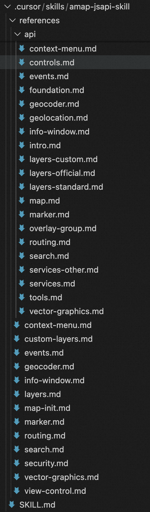
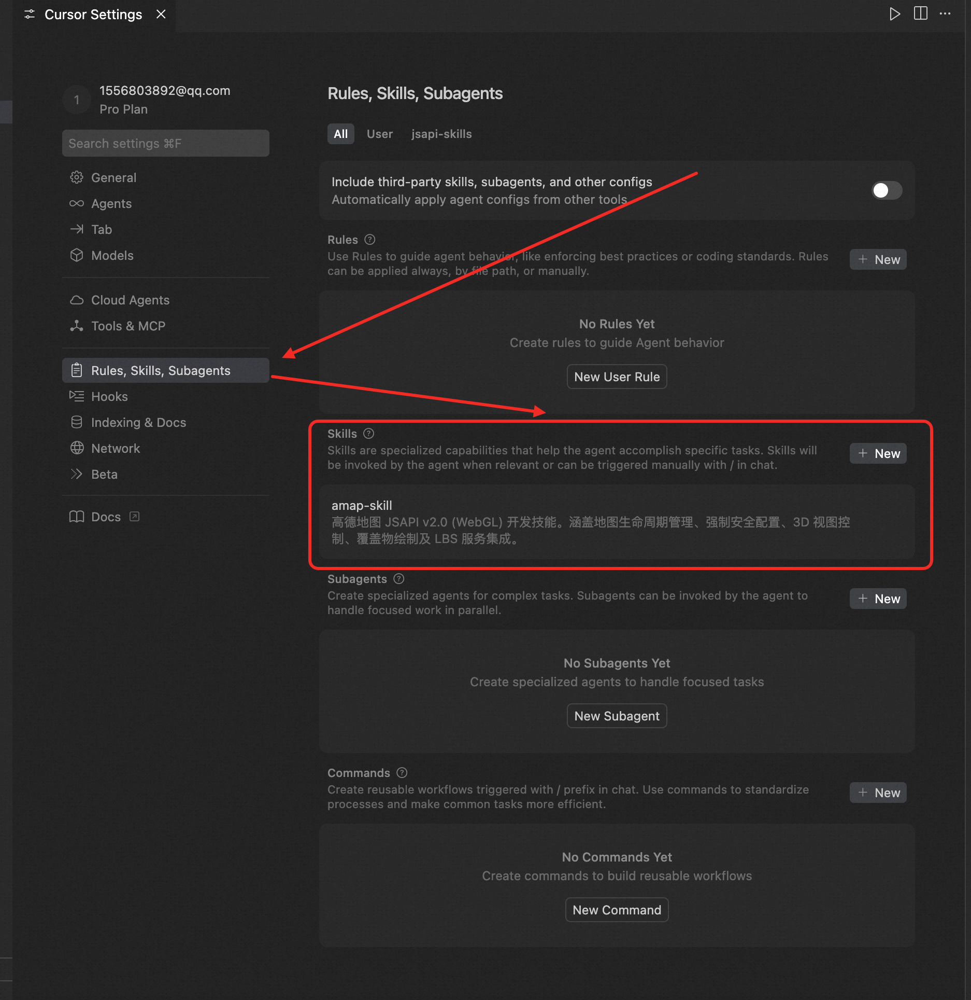
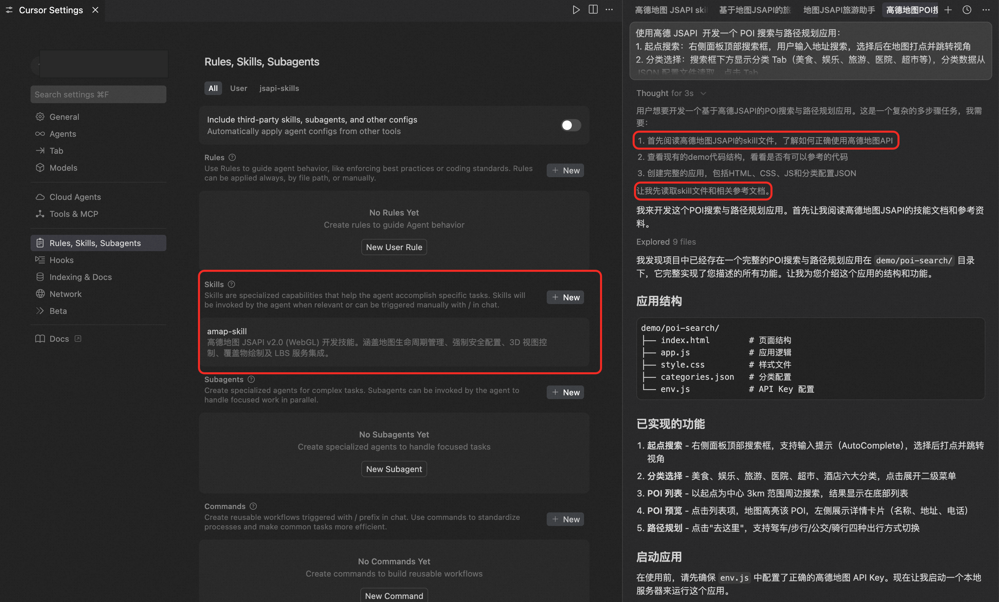

# JSAPI Skills User Guide

[🇨🇳 中文文档](./README_zh.md)

## Product Introduction

**AMap JSAPI Skills** is a set of AI programming skill packages designed specifically for AI IDEs. It integrates the official documentation, best practices, and code templates of AMap JavaScript API v2.0 into structured skill files, enabling AI coding tools like Cursor, Claude, and Cline to:

*   **Accurately understand** how to use AMap APIs
    
*   **Automatically generate** map code that complies with official specifications
    
*   **Proactively avoid** common development pitfalls and security issues
    
*   **Provide** verified complete code examples
    

Whether you're a beginner or an experienced map developer, this Skills package can significantly improve your development efficiency.

## Product Features

### Accurate API Knowledge

Built on the official AMap JSAPI v2.0 documentation, covering complete API capabilities to ensure generated code meets the latest specifications.

### Security First

Built-in security configuration guide that automatically reminds developers to configure security keys, avoiding map white screen issues due to authentication problems. Proxy solutions are recommended for production environments to protect your keys.

### Modular Design

Documentation organized by functional modules (map control, overlays, layers, LBS services), allowing AI to reference as needed and accurately answer your questions.

### Verifiable Code

All code examples have been verified. AI will self-validate the usability of generated code to ensure the output runs correctly.

## Capabilities

### Map Control

| **Capability** | **Description** |
| --- | --- |
| Map Initialization | Async loading, 3D/2D views, map style configuration |
| View Interaction | Zoom, pan, pitch, rotation control |
| Lifecycle Management | Load complete callback, resource destruction |
| Map Controls | Scale bar, toolbar, overview map, layer switcher |

### Overlay Drawing

| **Capability** | **Description** |
| --- | --- |
| Marker | Basic markers, custom icons, DOM content |
| LabelMarker | Supports tens of thousands of points, text/icon collision avoidance |
| Vector Graphics | Polylines, polygons, circles, rectangles |
| InfoWindow | Default info window, custom content window |
| Context Menu | Custom map/overlay right-click interactions |

### Layer Management

| **Capability** | **Description** |
| --- | --- |
| Standard Layers | Standard map, satellite, road network |
| 3D Layers | Building blocks, indoor maps |
| Custom Data Layers | Canvas layers, WMS/WMTS services |

### LBS Services & Plugins

| **Capability** | **Description** |
| --- | --- |
| Geocoding | Address to coordinates, coordinates to address |
| Route Planning | Driving, walking, cycling, transit routes |
| POI Search | Nearby search, keyword search, input suggestions |
| Event System | Click, drag, zoom and other interactive events |

## Quick Start

### Step 1: Get Skills Files

#### Option 1: Git Clone (Recommended)

```bash
# Clone the repository locally
git clone https://github.com/amap-web/amap-skills.git

# Enter the directory
cd amap-skills

```

#### Option 2: Direct Download

Download the latest version archive from the [Releases](https://github.com/AMap-Web/amap-skills/releases) page and extract it.

### Step 2: Configure Skill in Cursor

Cursor supports loading custom skills through the `.cursor/skills/` directory.

#### 2.1 Create Skills Directory

Create the `.cursor/skills/` folder in your project root directory:

```bash
mkdir -p .cursor/skills

```

#### 2.2 Link or Copy Skill Files

**Option 1: Symbolic Link (Recommended for easy updates)**

```bash
# macOS / Linux
ln -s /path/to/amap-skills/amap-jsapi-skill .cursor/skills/amap-jsapi-skill

# Windows (Run CMD as Administrator)
mklink /D .cursor\skills\amap-jsapi-skill C:\path\to\amap-skills\amap-jsapi-skill

```

**Option 2: Direct Copy**

```bash
cp -r /path/to/amap-skills/amap-jsapi-skill .cursor/skills/

```

#### 2.3 Project Directory Structure

After configuration, your project directory structure should look like:



```text
your-project/
├── .cursor/
│   └── skills/
│       └── amap-jsapi-skill/
│           ├── SKILL.md
|           └── api
|               |——map.md
|               |——layers.md
│           └── references/
│               ├── map-init.md
│               ├── marker.md
│               ├── security.md
│               └── ...
├── src/
├── package.json
└── ...

```



### Step 3: Verify Configuration

1.  Open Cursor IDE
    
2.  Open your project
    
3.  Press `Cmd/Ctrl + L` to open AI Chat
    
4.  Enter a test question:
    

```text
Help me develop a POI search and route planning application using AMap JSAPI:
0. The map API key is in the env.js file, use this as the map key
1. Origin search: Search box at the top of the right panel, user enters address to search, select to mark on map and jump to view
2. Category selection: Category tabs below the search box (Food, Entertainment, Tourism, Hospital, Supermarket, etc.), category data read from JSON config file. Click tab to expand secondary menu (e.g., Food - Hot Pot, BBQ, Sichuan Cuisine, etc.)
3. POI list: Click secondary menu item to perform nearby search centered on origin, results displayed in bottom list
4. POI preview: Click list item, map highlights the POI and displays a detail card on the left showing details (name, address) with a "Go Here" button
5. Route planning: Click "Go Here" to plan route from origin to this POI as destination, default driving, supports switching to walking/transit/cycling

```



If AI correctly uses the AMap JSAPI skill files during the thinking process as shown above and generates complete code including security configuration, the Skill has been successfully loaded. You can correctly configure the JSAPI key to view the page.


### Step 4: Apply for AMap Developer Key

If you don't have an AMap developer account yet, follow these steps to apply:

1.  Visit [AMap Open Platform Console](https://console.amap.com/)
    
2.  Register and log in
    
3.  Go to "Application Management" → "My Applications"
    
4.  Click "Create New Application"
    
5.  Add Key, select "Web (JS API)" service
    
6.  Get your **Key** and **Security Key**
    

> **Important**: Since December 2021, AMap JSAPI v2.0 requires mandatory security key configuration, otherwise the map will not load.

## Usage Examples

### Example 1: Basic Map

Describe your requirements to Cursor AI:

```text
Create a React component that displays an AMap, centered on Shanghai Bund, zoom level 15, using the dark phantom theme style

```

### Example 2: Add Markers

```text
Add 3 markers on the map, marking Beijing, Shanghai, and Guangzhou respectively. When clicking a marker, display an info window with the city name

```

### Example 3: Route Planning

```text
Implement driving route planning from Beijing to Shanghai, draw the route on the map, and display estimated driving time and distance

```

### Example 4: POI Search

```text
Add a search box. After user enters keywords, search for restaurants within 5 kilometers on the map and display the search results

```

## Best Practices

### Security Configuration

```javascript
// Development environment: Direct configuration (for local debugging only)
window._AMapSecurityConfig = {
  securityJsCode: 'Your security key',
};

// Production environment: Use proxy forwarding (Recommended)
window._AMapSecurityConfig = {
  serviceHost: 'https://your-domain.com/_AMapService',
};

```

### Resource Cleanup

```javascript
// Always destroy the map when component unmounts to prevent memory leaks
useEffect(() => {
  // Initialize map...
  
  return () => {
    map?.destroy();
  };
}, []);

```

### Load Plugins On Demand

```javascript
// Only load required plugins to reduce initial resource size
AMapLoader.load({
  key: 'Your Key',
  version: '2.0',
  plugins: ['AMap.Scale', 'AMap.Geocoder'], // Declare as needed
});

```

## Directory Structure

```text
amap-jsapi-skill/
├── SKILL.md                    # Main skill file (AI entry point)
└── references/                 # Detailed reference documentation
    ├── map-init.md             # Map initialization
    ├── view-control.md         # View control
    ├── marker.md               # Markers
    ├── vector-graphics.md      # Vector graphics
    ├── info-window.md          # Info window
    ├── context-menu.md         # Context menu
    ├── layers.md               # Base layers
    ├── custom-layers.md        # Custom layers
    ├── events.md               # Event system
    ├── geocoder.md             # Geocoding
    ├── routing.md              # Route planning
    ├── search.md               # POI search
    └── security.md             # Security configuration

```

## FAQ

### Q: Map shows white screen or INVALID\_USER\_KEY error

**A:** Please check:

1.  Whether `window._AMapSecurityConfig` is configured before `AMapLoader.load`
    
2.  Whether Key and security key match
    
3.  Whether Key is enabled in AMap console
    

### Q: Cursor AI doesn't use knowledge from Skill

**A:** Please ensure:

1.  Skill files are placed in the `.cursor/skills/` directory
    
2.  `SKILL.md` file exists and is correctly formatted
    
3.  Try explicitly mentioning "AMap" in your questions
    

### Q: How to update Skill?

If using the copy method, you need to re-copy the latest files.

## Related Links

*   [AMap JSAPI Official Documentation](https://lbs.amap.com/api/jsapi-v2/summary/)
    
*   [AMap Open Platform Console](https://console.amap.com/)
    
*   [Cursor Official Documentation](https://docs.cursor.com/)
    
*   [JSAPI Demo Center](https://lbs.amap.com/demo/list/jsapi-v2)
    

**Let AI become your map development assistant, starting today!**
